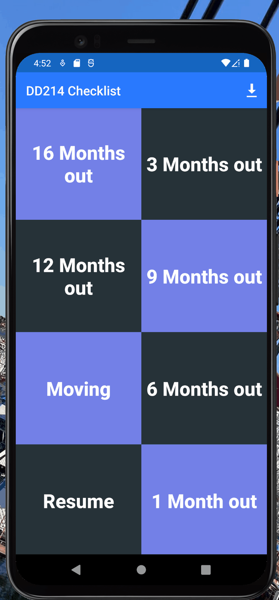

Original App Design Project - README Template (Update 4/16/22)
Other than me, there is only 1 student left in my class; there is no “group”.
We’re both working our own app. However, please find below gif showing progress as I have a steady plan
===

# military_transition_guide to complement https://www.militarytransition.vet/

## Table of Contents
1. [Overview](#Overview)
1. [Product Spec](#Product-Spec)
1. [Wireframes](#Wireframes)
2. [Schema](#Schema)

## Overview
### Description
An app to complement this website I donated to veteran service offices. There will be buttons which give access to a checklist guiding a service member to tasks which should be completed at certain timeframes counting down from 18 months.

### App Evaluation
[Evaluation of your app across the following attributes]
- **Category:** An interactive checklist guide
- **Mobile:** Mobile only but can link to website for another reference.
- **Story:** It allows a user to enter a guide applicable to how far along they are from exiting the military.
- **Market:** Military members 
- **Habit:** Daily updates 
- **Scope:** It could be given to transitioning service members at their during their appointments. 

## Product Spec

### 1. User Stories

**Required Must-have Stories**

* App opens with requirements
* User checks off completed items
* User can add new items
* User can download list
* User can delete items

**Optional Nice-to-have Stories**

* Stories of successful or unsuccessful transitions out of the military.

### 2. Screen Archetypes

* A dashboard of all the key timeframes
   * Select a time frame
	* Enter checklist
	* Edit or add items
	* Back to main

### 3. Navigation
**Flow Navigation** 

* Select timeframe
* Edit/update milestones
* Download list
* Go back to main

## Wireframes

[BONUS] Digital Wireframes & Mockups

## Progress

### Models
#### Post

   | Property      | Type     | Description |
   | ------------- | -------- | ------------|
   | View task       | String   | List displayed to user  |
   | Add task    | String | Author adds task |
   | Download    | .txt file| User can dowload list |
   | Delete   | Delete| User can delete a list |

### Networking
#### List of network requests by screen
   - This app wont interact with a database.

#### [OPTIONAL:] Existing API Endpoints
##### Still planning. Not sure if I will utilize API features.

- Base URL - See project. 

   HTTP Verb | Endpoint | Description
   ----------|----------|------------
    `GET`    | /inwork | still planning

   
